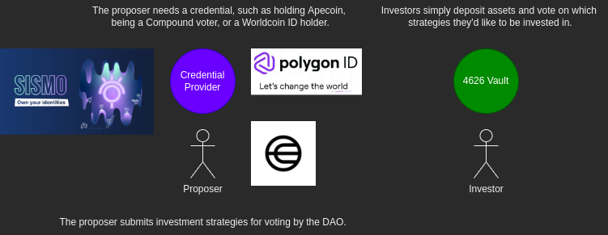
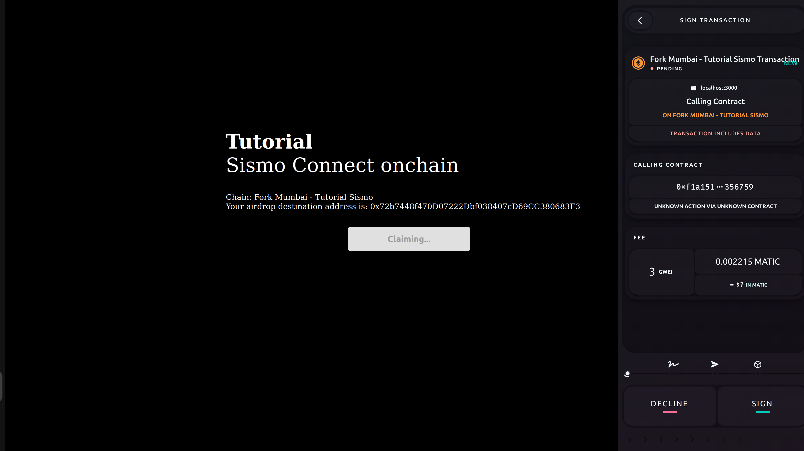
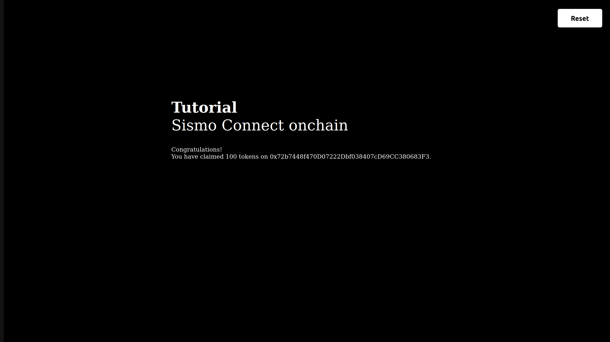
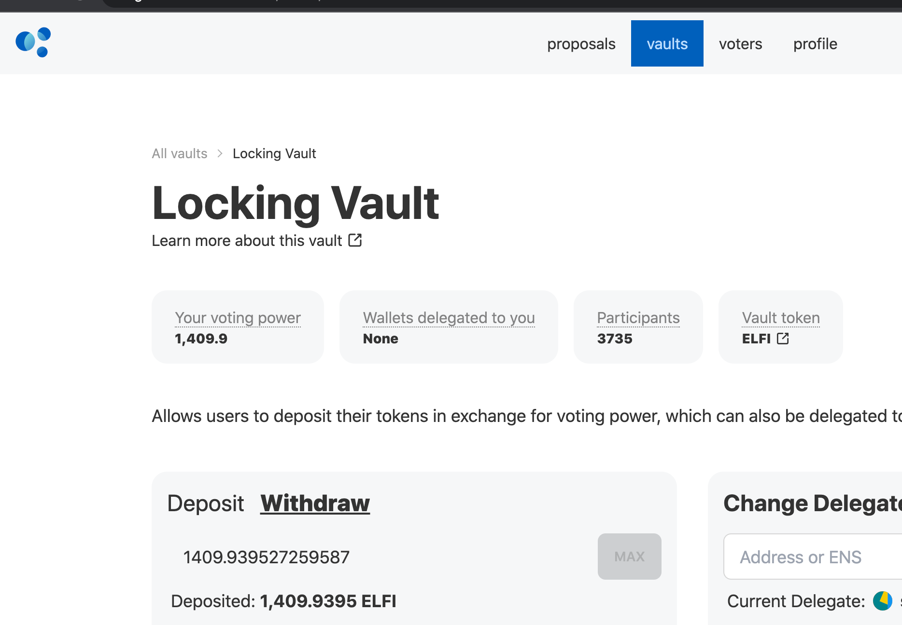
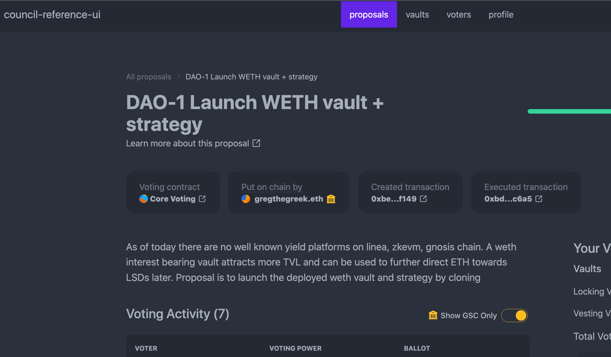

# DAO_Managed_Vault

# Abstract

Permissionless creation of simple interest bearing vaults and strategies.  
Usable Dapps are necessary on new chains and cross-listing of protocols is beneficial for protocols involved.  
Yield or interest rate farming via Yearn style vaults and strategies is a common contract system pattern heavily used across the ecosystem and boosts chain TVLs when first launched.  
We allow a pre-set group of real users (worldcoin/sismo sybil resistant IDs) to create and deploy ERC4626 vaults via a clone function protected by GovernorBravo.  

# Introduction 

Imagine a new user on a new chain.  They want to earn interest and try new protocols but aren't sure where to start.  
But there's a good chance they've used yearn on mainnet or beefy on other chains. 
The DAO managed vault system allows DAO members to permissionlessly deploy new vaults and strategies.  
A helping hand of sorts for new users to discover new protocols and earn interest. 
And for slightly more experiemced users to create new vaults with alpha and research on the chain and earn part of the pool interest.   

# Problems
- Difficult to discover new protocols on new chains
- Difficult to deploy contracts on new chains sometimes
- Non-technical users and investors may have alpha but cannot share it in a profitable manner
- No incentives to truly share alpha
- Yield bearing protocols can often rug/move tokens on behalf of users

# Solutions

- Our systems features a simple ERC4626 vault and underlying strategy pairing.
- Each vault has just 1 strategy
- Real users can create new vaults and strategies using the clone function
- This allows for sharing of alpha
- Alongside earning part of the yield as incentives

The solution allows for faster iteration of yield bearing vaults and permissionless creation even in the absence of core-devs maintaining the protocol. 

# Impl

1. Frontend uses sismo and/or world coin starter kits
2. Sismo connect or idkit is used to verify if a user is real
3. Unique users are allowed to mint a governance token
4. The token is accepted in a Compound GovernorBravo compliant contract to create proposals via Tally/Delv
5. Once the proposal passes, calldata in it is executed, this would typically be of type `clone(...)` which would create new vaults and strategies with different underlying and deposit contracts (Compound / crv)
6. Users could then interact with these new vaults and deposit the given underlying token
7. On deposit/withdraw andSync is called, which reports losses/gains from the strategy to the vault while updating share math accurately
8. Users can withdraw the underlying token + interest at the end of the reward cycle length.
Note: Care is and must continue to be taken to ensure safety against ERC4626 inflation attacks.

# Projects Incorporated:
### Deployed on
- NEAR BOS https://near.org/chimera_defi.near/widget/Daovault
- Linea
- Polygon zkEVM
	Polygon Tweet link: https://twitter.com/GoodMorninnnng/status/1672864573362262016?s=20
   - Deployment Addresses:
	- Vault: https://testnet-zkevm.polygonscan.com/address/0x013D706Ff9bdA75C390a4611F512ee61Ecbf9389
  	- Strategy: https://testnet-zkevm.polygonscan.com/address/0x8a53ca850564ae980bcf43a679d11cfe90fc418b
  	- Vault Token Wrapper: https://testnet-zkevm.polygonscan.com/address/0x60d09097d21Aca152e6825EFEADE395609F6a025
	- Vault Governor: https://testnet-zkevm.polygonscan.com/address/0x572c2ea3469917c1f3a072b62a4778d8b39dbd33
	- Note: Governance and token wrapper still need to be properly introduced to the vault-strategy pairing.
- Goerli
  - Relevant Address links located: https://www.one-tab.com/page/v5UmgDBvTcWpBYdB8goowA
- Gnosis Chiadao

### Using RPC
- Quicknode

### Deployed With
- Delv

### Credentials Powered By
- Sismo
- Worldcoin

# Dev Docs
## Deployment Stages
1. Deploy new instance of ACTUAL4626 - 0x6637867dF88Ae4a24C090E5B03C6255a1f5b51cE
   	  Constructor:
	     Set the underlying, Set the rewards cycle
	     Governor is temporarily set to my EOA
Optional: Verify the vault on etherscan.

2. Deploy a strategy - 0x5d309a073505991beDB1cc14Af5C189B092d2104
	  Constructor:
	   Set the underlying
	   Set the vault to be the ACTUAL2626 addy
Optional: Verify the strategy on etherscan.

3. Set the strategy of the Actual4626 to be whatever strategy address is being used.
     Constructor:
      Approve the vault on the underlying.
      Deposit into the vault and receive share tokens.
Optional: Call syncRewards on the ACTUAL4626 to simply move assets from the vault into the strategy.

4. Deploy a vaultTokenWrapperFlattened - 0x261ED1EAE1829e18728088cc72C9459cD551AC2F
	Constructor:
	 Use the ACTUAL4626 Vault receipt token as the underlying token to wrap.
Optional: Verify the contract on Etherscan.

5. Approve the vaultTokenWrapperFlattened on the ACTUAL4626.
   
6. Wrap the vault receipt token into the vault token wrapper by calling depositFor.

7. Deploy vault_governor_flattened 
	Constructor:
	 Set the underlying to be the wrapped vault token.
	 Set the timelock to be 0x00000.....(0x00 address)
  Verify contract if neccessary 

8. Create the governor on tally or Delv using the right addresses n whatnot...
9. Add the given governor to the list of pre-approved governors....
10. The DAO can then vote to remove the EOA governor from the list.

# Photo Album

Becoming a proper is easy!
![Generate Proof](doc/scr1.png
First generate your proof with Sismo connect

Then claim your proposal tokens

Congrats! You're a proposer now

Delv mainnet Element fi council

Delv localhost with proposals against vaults/gov bravo
